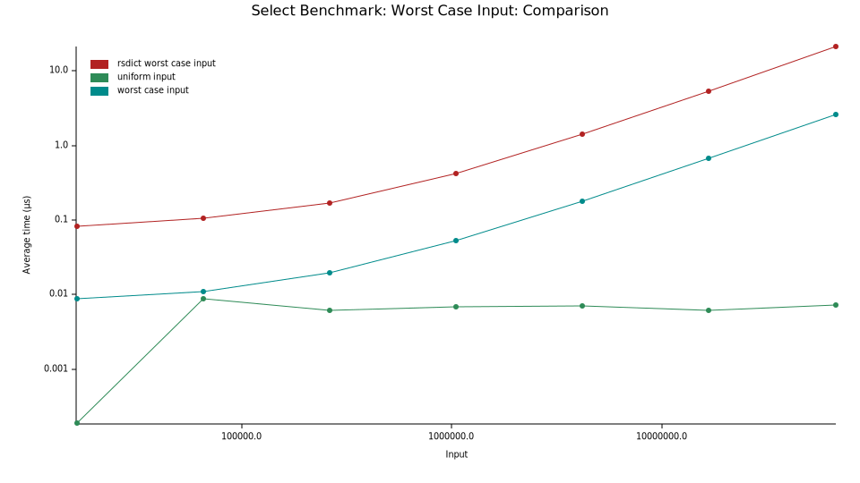
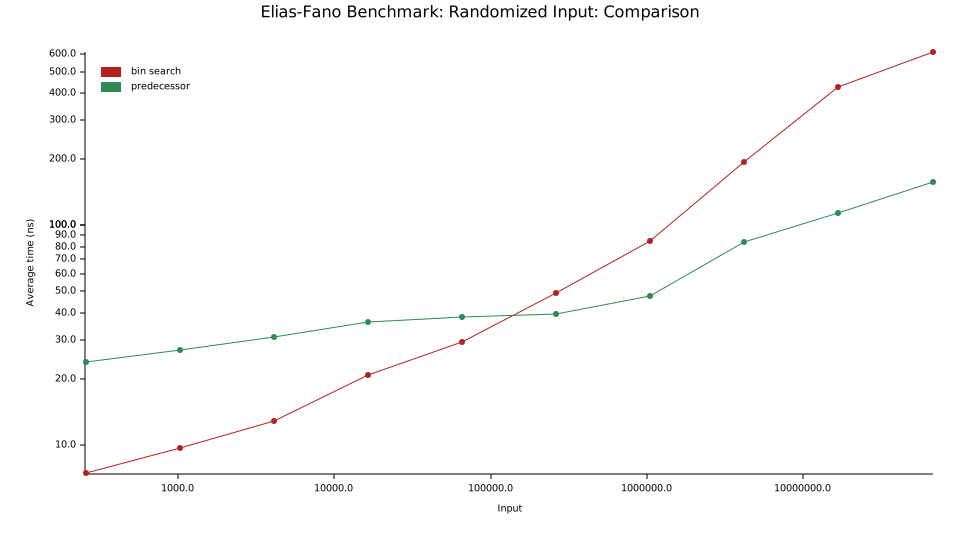
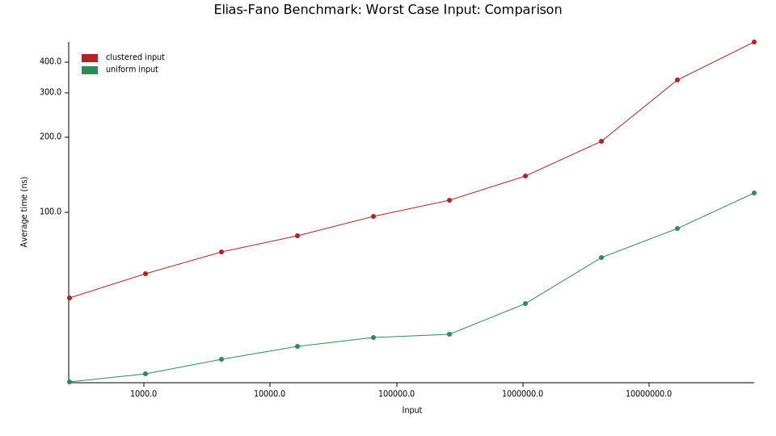
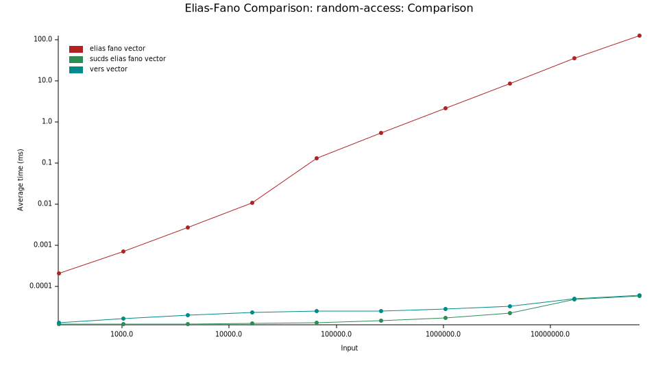
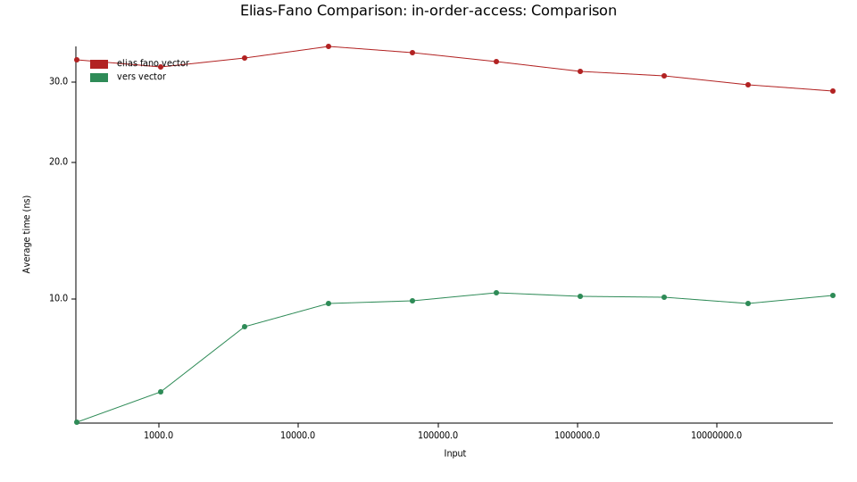

# Vers - Very Efficient Rank and Select

Vers (vers-vecs on crates.io)
contains pure-Rust implementations of several data structures backed by rank and select operations.
When using this library, it is strongly recommended to enable the `BMI2` and `popcnt` features for x86_64 CPUs,
or compile with the `target-cpu=native` flag,
since the intrinsics speed up both `rank` and `select` operations by a factor of 2-3.

## Data Structures
- a bit-vector with no overhead.
- a succinct bit-vector supporting fast rank and select queries.
- an Elias-Fano encoding of monotone sequences; supporting constant time predecessor/successor queries.
- two Range Minimum Query vector structures for constant-time range minimum queries.

# Intrinsics
This crate uses compiler intrinsics for bit-manipulation. The intrinsics are supported by
all modern x86_64 CPUs, but not by other architectures.
There are fallback implementations if the intrinsics are not available, but they are significantly slower.
Using this library on `x86` CPUs without enabling `BMI2` and `popcnt` target features is not recommended.

The intrinsics in question are `popcnt` (supported since SSE4.2 resp. SSE4a on AMD, 2007-2008),
`pdep` (supported with BMI2 since Intel Haswell resp. AMD Excavator, in hardware since AMD Zen 3, 2011-2013),
and `tzcnt` (supported with BMI1 since Intel Haswell resp. AMD Jaguar, ca. 2013).

## Safety
This crate uses no unsafe code, with the only exception being compiler intrinsic for `pdep`.
The intrinsics cannot fail with the provided inputs (provided they are
supported by the target machine), so even if they were to be implemented incorrectly, no
memory corruption can occur (only incorrect results).

Unsafe code is hidden behind public API.

## Dependencies
The library has no dependencies outside the Rust standard library by default.
It has a plethora of dependencies for benchmarking purposes, but these are not required for normal use.
Optionally, the `serde` feature can be enabled to allow serialization and deserialization of the data structures,
which requires the `serde` crate and its `derive` feature.

## Benchmarks
I benchmarked the implementations against publicly available implementations of the same data structures.
The benchmarking code is available in the `bench` directory.
When I benchmarked, I used the ``simd`` feature of rsdict, which required nightly Rust.
The feature depends on the `packed_simd` crate, which is currently not compiling anymore, so I disabled the feature.
This will reduce the performance of the rsdict crate if you run the benchmarks.

I performed speed benchmarks on a Ryzen 9 7950X with 32GB of RAM.
The results are shown below.
All benchmarks were run with the `target-cpu=native` flag enabled.

### Bit-Vector
#### Rank & Select
The bit-vector implementation is among the fastest publicly available implementation for rank and select operations.
Note that the `succinct` crate outperforms Vers' `rank` operation, but does not provide an efficient select operation.
The `sucds` generally performs better than `vers` in average case, but is significantly slower in worst case (see below).

The x-axis is the number of bits in the bit-vector.
An increase in all runtimes can be observed for input sizes exceeding the L2 cache size (16 MB).

| Legend            | Crate                                   | Notes                               |
|-------------------|-----------------------------------------|-------------------------------------|
| bio               | https://crates.io/crates/bio            | with adaptive block-size            |
| fair bio          | https://crates.io/crates/bio            | with constant block-size            |
| fid               | https://crates.io/crates/fid            |                                     |
| indexed bitvector | https://crates.io/crates/indexed_bitvec |                                     |
| rank9             | https://crates.io/crates/succinct       | Fastest of multiple implementations |
| rsdict            | https://crates.io/crates/rsdict         |                                     |
| vers              | https://github.com/Cydhra/vers          |                                     |
| sucds-rank9       | https://crates.io/crates/sucds          |                                     |
| sucds-darray      | https://crates.io/crates/sucds          | Dense Set Implementation            |

#### Heap Size

Another benchmark measures the size overhead of the bit-vector implementations.
The benchmark code can be found in the `examples/` directory.
The x-axis is the number of bits in the bit-vector,
the y-axis is the additional overhead in percent compared to the size of the bit-vector.
Only the fastest competitors are shown to make the graph more readable
(I would like to add the bio crate data structure as well, since it is the only truly succinct one,
but it does not offer an operation to measure the heap size).
Vers achieves its high speeds with significantly less memory overhead, as can be seen in the heap size benchmark.
The legend contains the measurement for the biggest input size,
because I assume that the overhead approaches a constant value for large inputs.

#### Worst Case

Below is a select-query benchmark of adversarial input distributions 
(long vector of zeros and then a lot of ones at the end)
for the `vers` and `rsdict` crate.
It does not include a measurement for the `sucds` crate:

For small worst-case bit distributions, Vers' implementation is significantly faster than the `sucds` crate.
Since the `sucds` crate relies on dense arrays, the worst-case for `vers` is different from the worst case for `sucds`,
and I was unable to find a worst-case distribution for the latter.
It is unclear if the `sucds` crate is faster than Vers' implementation for worst-case distributions,
or if I was simply unable to find a suitable worst-case distribution.
If worst-case runtimes are important to you, I recommend benchmarking both crates with data representative of your
input bit distribution (since both crates have different worst-case scenarios), or to default to `vers`
(look at the benchmark code to get an idea what distributions are bad for `vers`).

### Elias-Fano
The benchmark compares the performance of Vers' implementation against a naive implementation that uses binary search
to find the predecessor.
The x-axis is the number of elements in the sequence.
An increase in the near-constant runtime can be observed for input sizes exceeding the L3 cache size 
(64 MB).
As expected, predecessor and successor queries are the same speed and much faster than binary search (for large inputs).

Another benchmark for worst-case input distributions shows that Vers' implementation is still only a factor slower than
on average inputs and asymptotically equal to binary search.
I did not include the successor query in this benchmark, since it is identical to the predecessor query.
Notably, `sucds` runtime grows exponentially with the number of elements in the sequence for worst-case distributions.

There is an Elias-Fano implementation in the [elias-fano](https://crates.io/crates/elias-fano) crate,
which does not support predecessor/successor queries, but I benchmarked the access times for elements at a given index.
It should be noted that the elias-fano crate is inefficient with random order access, so I benchmarked in-order access
as well.
The x-axis is the number of elements in the sequence, the y-axis is the time for accessing one element.
Scales are logarithmic.

### Range Minimum Query
The Range Minimum Query implementations are compared against the 
[range_minimum_query](https://crates.io/crates/range_minimum_query) and 
[librualg](https://crates.io/crates/librualg) crate.
Vers outperforms both crates by a significant margin.
The x-axis is the number of elements in the sequence.
An increase in runtime can be observed for input sizes exceeding the L3 cache size (64 MB).

## License
Licensed under either of

* Apache License, Version 2.0
  ([LICENSE-APACHE](LICENSE-APACHE) or http://www.apache.org/licenses/LICENSE-2.0)
* MIT license
  ([LICENSE-MIT](LICENSE-MIT) or http://opensource.org/licenses/MIT)

at your option.

This project includes code developed by [Gonzalo Brito Gadeschi](https://raw.githubusercontent.com/gnzlbg/bitintr)
originally licensed under the MIT license.
It is redistributed under the above dual license.

## Contribution
Unless you explicitly state otherwise, any contribution intentionally submitted
for inclusion in the work by you, as defined in the Apache-2.0 license, shall be
dual licensed as above, without any additional terms or conditions.