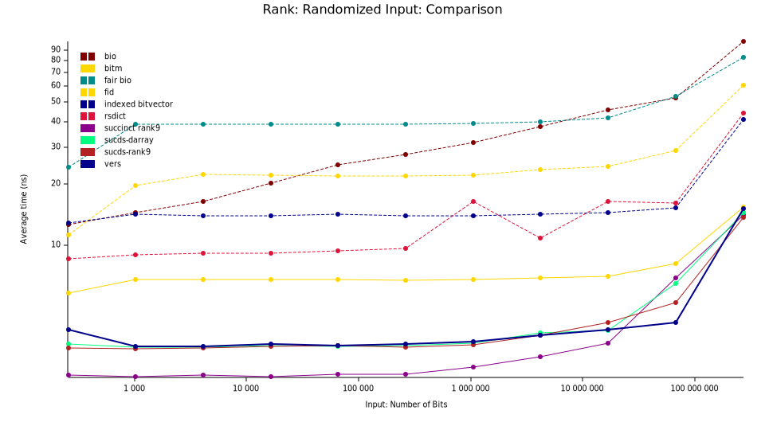

# Vers - Very Efficient Rank and Select

Vers (vers-vecs on crates.io)
contains pure-Rust implementations of several data structures backed by rank and select operations.
The library was originally a grad student project for a semester course,
but since it outperforms all publicly available implementations (and won a competition within the course)
I've decided to publish it.

## Data Structures
- a bit-vector with no overhead.
- a succinct bit-vector supporting fast rank and select queries.
- an Elias-Fano encoding of monotone sequences; supporting constant time predecessor queries.
- two Range Minimum Query vector structures for constant-time range minimum queries.

## Beta Status
I published this library as 0.1.0 as a beta release.
The implementation is tested, benchmarked, optimized, and documented.
However, I currently ignore many edge-cases, like illegal inputs.
Such cases are documented and must be checked by the caller if they are possible.

This, and a few other rough spots concerning the API Guidelines, are the reason for the beta status.

# Intrinsics
This crate uses compiler intrinsics for bit-manipulation. The intrinsics are supported by
all modern x86_64 CPUs, but not by other architectures. Since the data structures depend
very heavily on these intrinsics, they are forcibly enabled, which means the crate will not
compile on non-x86_64 architectures, and will not work correctly on very old x86_64 CPUs.

The intrinsics in question are `popcnt` (supported since SSE4.2 resp. SSE4a on AMD, 2007-2008),
`pdep` (supported with BMI2 since Intel Haswell resp. AMD Excavator, in hardware since AMD Zen 3, 2011-2013),
and `tzcnt` (supported with BMI1 since Intel Haswell resp. AMD Jaguar, ca. 2013).

Rust offers library functions for popcount and trailing zero count, but not for parallel deposit,
which is why I cannot fall back to a software implementation for different architectures.

## Safety
This crate uses no unsafe code, with the only exception being compiler intrinsics for
bit-manipulation. The intrinsics cannot fail with the provided inputs (provided they are
supported by the target machine), so even if they were to be implemented incorrectly, no
memory unsafety can occur (only incorrect results).

## Dependencies
The library has no dependencies outside the Rust standard library.
It has a plethora of dependencies for benchmarking purposes, but these are not required for normal use.
Optionally, the `serde` feature can be enabled to allow serialization and deserialization of the data structures,
which requires the `serde` crate and its `derive` feature.

## Benchmarks
I benchmarked the implementations against publicly available implementations of the same data structures.
The benchmarking code is available in the `bench` directory.
Since one of the available implementations requires nightly Rust,
compiling this project in any configuration that includes tests or benchmarks requires nightly Rust.

I performed benchmarks on a Ryzen 9 7950X with 32GB of RAM.
The results are shown below.

### Bit-Vector
The bit-vector implementation is the fastest publicly available implementation for rank and select operations.
Note that the `succinct` crate outperforms Vers' `rank` operation, but does not provide an efficient select operation.
The x-axis is the number of bits in the bit-vector.
An increase in all runtimes can be observed for input sizes exceeding the L2 cache size (16 MB).

| Legend           | Crate                                    | Notes                               |
|------------------|------------------------------------------|-------------------------------------|
| bio              | https://crates.io/crates/bio             | with adaptive block-size            |
| fair bio         | https://crates.io/crates/bio             | with constant block-size            |
| fid              | https://crates.io/crates/fid             |                                     |
| indexed bitvector | https://crates.io/crates/indexed_bitvec |                                     |
| rank9            | https://crates.io/crates/succinct        | Fastest of multiple implementations |
| rsdict           | https://crates.io/crates/rsdict          |                                     |
| vers             | https://github.com/Cydhra/vers           |                                     |

### Elias-Fano
There are no publicly available implementations of Elias-Fano encodings with predecessor queries.
The benchmark compares the performance of Vers' implementation against a naive implementation that uses binary search
to find the predecessor.
The x-axis is the number of elements in the sequence.
An increase in the near-constant runtime can be observed for input sizes exceeding the L3 cache size 
(64 MB).

Another benchmark for worst-case input distributions shows that Vers' implementation is still only a factor slower than
on average inputs and asymptotically better beginning in the low megabytes.

### Range Minimum Query
The Range Minimum Query implementations are compared against the 
[range_minimum_query](https://crates.io/crates/range_minimum_query) and 
[librualg](https://crates.io/crates/librualg) crate.
Vers outperforms both crates by a significant margin.
The x-axis is the number of elements in the sequence.
An increase in runtime can be observed for input sizes exceeding the L3 cache size (64 MB).

## License

Licensed under either of

* Apache License, Version 2.0
  ([LICENSE-APACHE](LICENSE-APACHE) or http://www.apache.org/licenses/LICENSE-2.0)
* MIT license
  ([LICENSE-MIT](LICENSE-MIT) or http://opensource.org/licenses/MIT)

at your option.

## Contribution

Unless you explicitly state otherwise, any contribution intentionally submitted
for inclusion in the work by you, as defined in the Apache-2.0 license, shall be
dual licensed as above, without any additional terms or conditions.