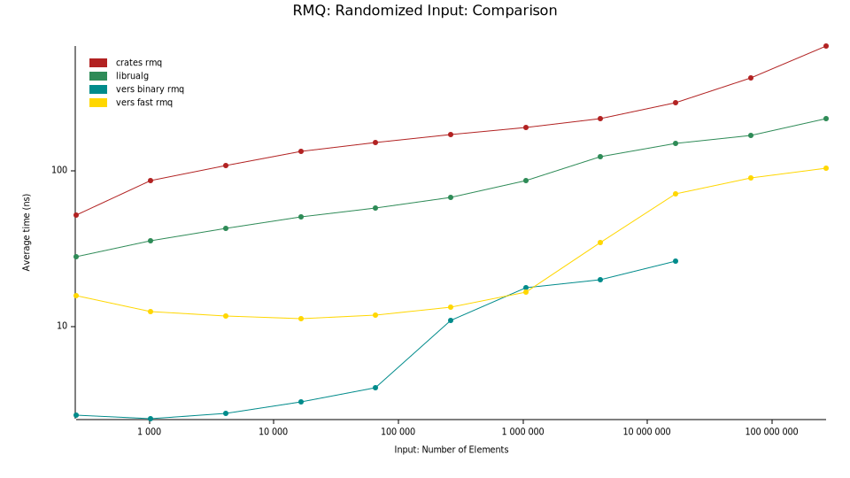

# Vers - Very Efficient Rank and Select

Vers (vers-vecs on crates.io)
contains pure-Rust implementations of several data structures backed by rank and select operations.
When using this library, it is strongly recommended to enable the `BMI2` and `popcnt` features for x86_64 CPUs
or compile with the `target-cpu=native` flag,
since the intrinsics speed up both `rank` and `select` operations by a factor of 2-3.

## Data Structures
- A fully-featured bit vector with no memory overhead.
- A succinct bit vector supporting fast rank and select queries.
- An Elias-Fano encoding of monotone sequences supporting constant-time predecessor/successor queries.
- Two Range Minimum Query vector structures for constant-time range minimum queries.
- A Wavelet Matrix supporting `O(k)` rank, select, statistical, predecessor, and successor queries.

## Why Vers?
- **Performance**: Vers is among the fastest publicly available implementations for its data structures.
There are faster operations in some cases, but you never have to sacrifice substantial performance for Vers' convenience.
- **Memory Efficiency**: Vers has an extremely low memory overhead compared to other implementations, especially compared
to the high-performing `sucds` crate.
- **API**: Vers aims to provide a simple and convenient API that does not require the user to understand the underlying data structures.
The API is well-integrated within the Rust ecosystem.
- **Feature Rich**: Vers aims to provide more functionality than other libraries.
It provides more convenience functions and supports more operations than libraries that compare in performance.
The standard bit vector offers a wide range of functions for bit manipulation, 
the Rank/Select bit vector supports special-purpose iterators exploiting its rank/select structure,
and the Elias-Fano encoding supports constant-time predecessor/successor queries.
- **Documentation**: Vers is extremely well-documented and provides examples for all data structures.
- **No Dependencies**: Vers has no dependencies by default.
- **Safety**: Without the `simd` feature, Vers uses no unsafe code that handles raw pointers.
The only unsafe call is the compiler intrinsic for the arithmetic instruction `pdep`.

## Crate Features
- `simd`: Enables the use of SIMD instructions for rank and select operations.
This feature requires AVX-512 support and uses unsafe code.
It also enables a special iterator for the rank/select bit vector that uses vectorized operations.
The feature only works on nightly Rust.
Enabling it on stable Rust is a no-op, because the required CPU features are not available there.
- `serde`: Enables serialization and deserialization of the data structures using the `serde` crate.

## Benchmarks
I benchmarked the implementations against publicly available implementations of the same data structures.
The benchmarking code is available in the [vers-benchmarks](https://github.com/Cydhra/vers_benchmarks) repository.
The benchmark uses the `simd` feature of rsdict, which requires nightly Rust.

I performed the benchmarks on a Ryzen 9 7950X with 32GB of RAM.
Some of the results are shown below.
All benchmarks were run with the `target-cpu=native` flag enabled, and the `simd` feature enabled for Vers.
More results can be found in the benchmark repository.

### Bit-Vector
#### Rank & Select
The bit vector implementation is among the fastest publicly available implementations for rank and select operations.
Note that the `succinct` crate substantially outperforms Vers' `rank` operation but does not provide an efficient select operation.

The x-axis is the number of bits in the bit vector.
An increase in all runtimes can be observed for input sizes exceeding the L2 cache size (16 MB).

| Legend            | Crate                                   | Notes                               |
|-------------------|-----------------------------------------|-------------------------------------|
| bio               | https://crates.io/crates/bio            | with adaptive block-size            |
| fair bio          | https://crates.io/crates/bio            | with constant block-size            |
| fid               | https://crates.io/crates/fid            |                                     |
| indexed bitvector | https://crates.io/crates/indexed_bitvec |                                     |
| rank9             | https://crates.io/crates/succinct       | Fastest of multiple implementations |
| rsdict            | https://crates.io/crates/rsdict         |                                     |
| vers              | https://github.com/Cydhra/vers          |                                     |
| sucds-rank9       | https://crates.io/crates/sucds          |                                     |
| sucds-darray      | https://crates.io/crates/sucds          | Dense Set Implementation            |
| bitm              | https://crates.io/crates/bitm           |                                     |

#### Heap Size

The memory overhead of the bit vector implementation is significantly lower than that of other implementations.
The x-axis is the number of bits in the bit vector,
the y-axis is the additional overhead in percent compared to the size of the bit vector.
Only the fastest competitors are shown, to make the graph more readable
(I would like to add the bio crate data structure as well, since it is the only truly succinct one,
but it does not offer an operation to measure the heap size.
The same is true for the `bitm` crate, which claims to have a lower memory overhead compared to `Vers`,
but does not offer a convenient way of measuring it).
Vers achieves its high speeds with significantly less memory overhead, as can be seen in the heap size benchmark.
The legend contains the measurement for the biggest input size,
because I assume that the overhead approaches a constant value for large inputs.

### Elias-Fano
The benchmark compares the access times for random elements in the sequence.
The x-axis is the number of elements in the sequence.
Note, that the elias-fano crate is inefficient with random order access.
In-order access benchmarks can be found in the benchmark repository.

The following two benchmarks show the predecessor query times for average element distribution and the 
worst-case element distribution.
Note that Vers worst-case query times are logarithmic, while `sucds` has linear worst-case query times.

### Range Minimum Query
The Range Minimum Query implementations are compared against the 
[range_minimum_query](https://crates.io/crates/range_minimum_query) and 
[librualg](https://crates.io/crates/librualg) crate.
Vers outperforms both crates by a significant margin with both implementations.
An increase in runtime can be observed for input sizes exceeding the L3 cache size (64 MB).
The increase is earlier for the `BinaryRMQ` implementation, because it has a substantially higher memory overhead.
For the same reason, the final two measurements for the `BinaryRMQ` implementation are missing (the data structure
exceeded the available 32 GB main memory).

(Yes, the naming of both implementations is unfortunate, but they will stay until I do a major version bump.)

# Intrinsics
This crate uses compiler intrinsics for bit manipulation. The intrinsics are supported by
all modern x86_64 CPUs, but not by other architectures.
There are fallback implementations if the intrinsics are not available, but they are significantly slower.
Using this library on `x86` CPUs without enabling `BMI2` and `popcnt` target features is not recommended.

The intrinsics in question are `popcnt` (supported since SSE4.2 resp. SSE4a on AMD, 2007-2008),
`pdep` (supported with BMI2 since Intel Haswell resp. AMD Excavator, in hardware since AMD Zen 3, 2011-2013),
and `tzcnt` (supported with BMI1 since Intel Haswell resp. AMD Jaguar, ca. 2013).

## Safety
This crate uses no unsafe code, with the only exception being compiler intrinsic for `pdep`.
The intrinsics cannot fail with the provided inputs (provided they are
supported by the target machine), so even if they were to be implemented incorrectly, no
memory corruption can occur (only incorrect results).

Unsafe code is hidden behind public API.

## Dependencies
The library has no dependencies outside the Rust standard library by default.
It has a plethora of dependencies for benchmarking purposes, but these are not required for normal use.
Optionally, the `serde` feature can be enabled to allow serialization and deserialization of the data structures,
which requires the `serde` crate and its `derive` feature.

## License
Licensed under either of

* Apache License, Version 2.0
  ([LICENSE-APACHE](LICENSE-APACHE) or http://www.apache.org/licenses/LICENSE-2.0)
* MIT license
  ([LICENSE-MIT](LICENSE-MIT) or http://opensource.org/licenses/MIT)

at your option.

This project includes code developed by [Gonzalo Brito Gadeschi](https://github.com/gnzlbg/bitintr)
originally licensed under the MIT license.
It is redistributed under the above dual license.

## Contribution
Unless you explicitly state otherwise, any contribution intentionally submitted
for inclusion in the work by you, as defined in the Apache-2.0 license, shall be
dual licensed as above, without any additional terms or conditions.
